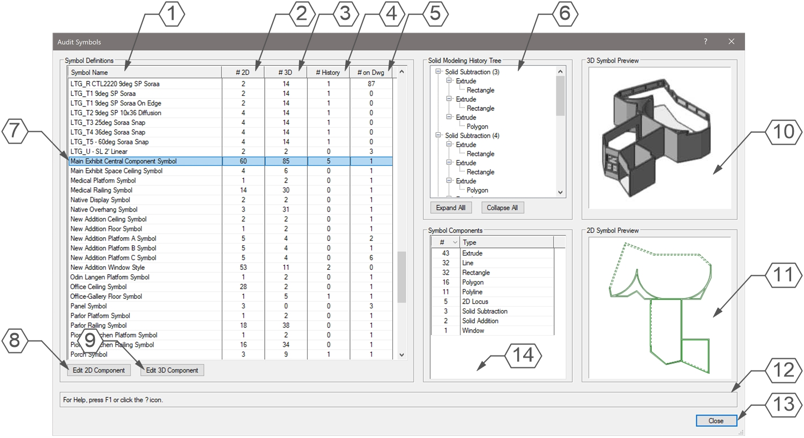

# Audit Symbols

Menu Command

## Version

1.0.1 - 7/20/2025

This plug-in is written in Vectorscript (Pascal) and can be used in any version of [Vectorworks](https://www.vectorworks.net) 2019 or newer.

## Description

Used for finding "heavy" Symbol Definitions within a Vectorworks drawing. Opens a dialog box showing all Symbol Definitions in the active drawing along with metrics such as the number and type of objects within the Symbol and any Solid Modeling History.

## Instructions

1. Run menu command.
1. Select a Symbol Definition from the List Browser window.
1. Press the **Edit 2D Component** button to enter into the 2D Component Edit window for the selected Symbol Definition or the **Edit 3D Component** button to enter into the 3D Component Edit window.

## Dialog Box Explanation

1. Column listing name of Symbol Definition.
1. Column listing number of objects in Symbol Definition's 2D component.
1. Column listing number of objects in Symbol Definition's 3D component.
1. Column listing number of objects in Symbol Definition with Modeling History.
1. Column listing number of Symbols within the active drawing.
1. If the selected Symbol Definition contains objects with Modeling History, a tree diagram of the Modeling History will appear here. Press the **Expand All** button to expand all tree items or **Collapse All** to collapse all tree items. Please note that the tree has a hard limit of 300 "children" objects for any given object, including the Symbol itself.
1. The currently selected Symbol Definition will be highlighted in the List Browser. Only one Symbol Definition may be selected at a time.
1. Press the **Edit 2D Component** button to jump into the 2D Component Edit for the selected Symbol Definition. This will close the dialog box.
1. Press the **Edit 3D Component** button to jump into the 3D Component Edit for the selected Symbol Definition. This will close the dialog box.
1. A preview of the 3D component of the selected Symbol Definition.
1. A preview of the 2D component of the selected Symbol Definition.
1. **Help Box**, mousing over any dialog box element will display an explanation here.
1. Press the **Close** button to close the dialog box.
1. A list of all object types within the selected Symbol Definition ordered by quantity of object type.

## Installation Instructions

There are two methods of installation, direct download of the plug-in or through the **JNC Tools Free Manager** plug-in.

### Direct Download:

1. Download [source plug-in file](Audit%20Symbols.vsm)
2. Place downloaded file inside the **Vectorworks User Folder** within the **Plug-ins** directory
3. Restart Vectorworks

### JNC Tools Free Manager

1. Run the [**JNC Tools Free Manager**](https://jncogs.github.io/JNC-Tools-Manager-Free/) menu command
2. Select the **Audit Symbols** command
3. Press the **Install / Update** button
4. Press **Close** to close the dialog box
5. Restart Vectorworks

## Adding the Plug-in to your Workspace

1. Open the **Workspace Editor** by going to **Tools - Workspaces - Edit Current Workspace**
2. Select the **Menus** tab
3. In the box on the left, find and expand the **JNC** category
4. In the box on the right, find a suitable menu to place the command in, such as **Tools** or **Modify**
5. Click and drag the **Audit Symbols** command from the box on the left to the desired menu location in the box on the right
6. Click **OK** to close the editor

## Localization Instructions

The plug-in can be localized to your native language without having access to the source code.  This can be achieved by following the instructions below:

1. Open the **Plug-in Manager** by going to **Tools - Plug-ins - Plug-in Manager**
2. Select the **Third-party Plug-ins** tab
3. Select the **Audit Symbols** command
4. Click the **Customize** button
5. Select the **Strings** tab
6. Double-click a category, such as **Dialog Strings**
7. Select a string to edit and press the **Edit** button
8. Write a new string and press the **OK** button until you are back to the **Plug-in Manager**

The categories for this plug-in are as follows:

- **3000** - *Dialog Strings*: These strings are used in the dialog box and can all freely be changed.
- **4000** - *Dialog Help Strings*: These strings are used in the **Help Box** at the bottom of the dialog box and can all freely be changed.
- **5000** - *Object Types*: These strings correspond to the internal object type numbers and can be changed to match localized wording as long as the numbering is consistent.
- **6000** - *Object Subtypes*: These strings correspond to the internal object subtype numbers and can be changed to match localized wording as long as the numbering is consistent.
- **7000** - *Misc Strings*: These strings are used for warnings to the user and can all freely be changed.
- **8000** - *Progress Bar Strings*: These strings are used in the progress bars and can all freely be changed.

## Release Notes

| Date | Version | Note |
| :---: | :---: | :--- |
| 07/19/2025 | 1.0.0 | Initial release |
| 07/20/2025 | 1.0.1 | Fixed bug with NURBS surfaces used in Object History causing a crash    Added Progress Bar for Symbol Analysis with cancel option |
| 07/20/2025 | 1.0.2 | Added Cancel button to Analyzing Modeling History progress bar |

## Known Bugs

No Known Bugs

## Feature Requests

No current Feature Requests

## License

Copyright (c) Jesse Cogswell (JNC Tools)

Permission is hereby granted, free of charge, to any person or organization
obtaining a copy of this software (the "User") and associated documentation files (the "Software"),
to use, reproduce, distribute, execute, and transmit the Software.

The User is not permitted to modify or attempt to reverse engineer the source code.  The User may
localize the Software using approved methods from within the Vectorworks software.

THE SOFTWARE IS PROVIDED "AS IS", WITHOUT WARRANTY OF ANY KIND, EXPRESS OR
IMPLIED, INCLUDING BUT NOT LIMITED TO THE WARRANTIES OF MERCHANTABILITY,
FITNESS FOR A PARTICULAR PURPOSE, TITLE AND NON-INFRINGEMENT. IN NO EVENT
SHALL THE COPYRIGHT HOLDERS OR ANYONE DISTRIBUTING THE SOFTWARE BE LIABLE
FOR ANY DAMAGES OR OTHER LIABILITY, WHETHER IN CONTRACT, TORT OR OTHERWISE,
ARISING FROM, OUT OF OR IN CONNECTION WITH THE SOFTWARE OR THE USE OR OTHER
DEALINGS IN THE SOFTWARE.